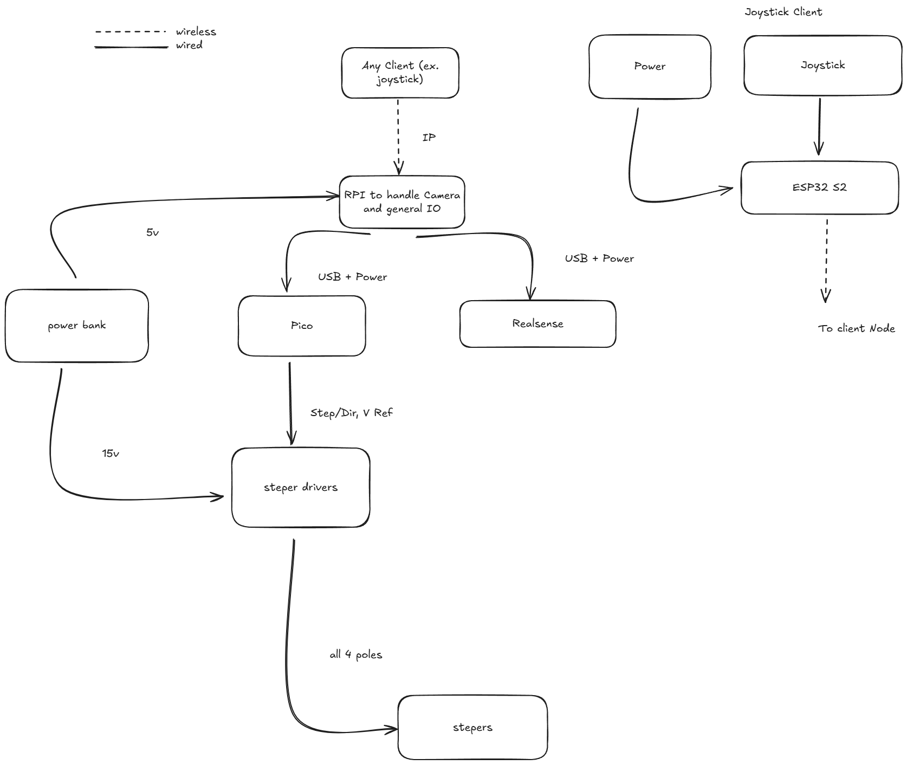
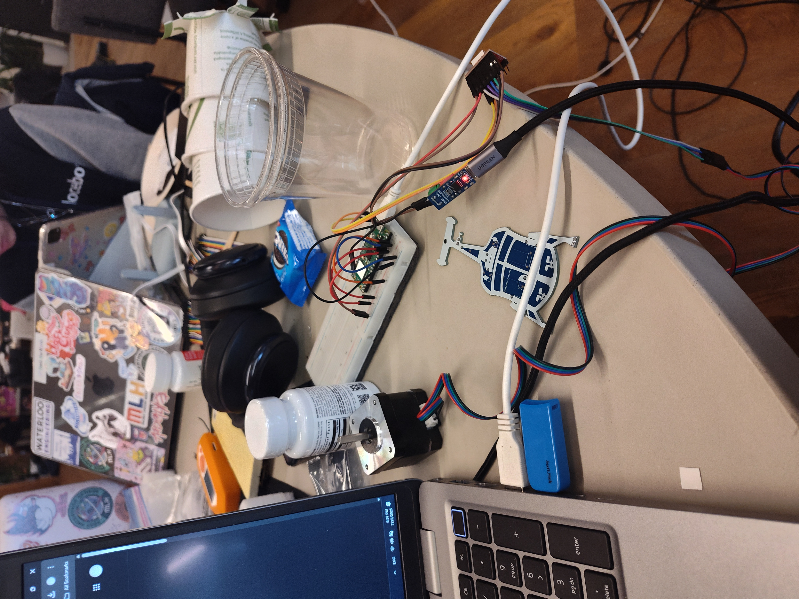
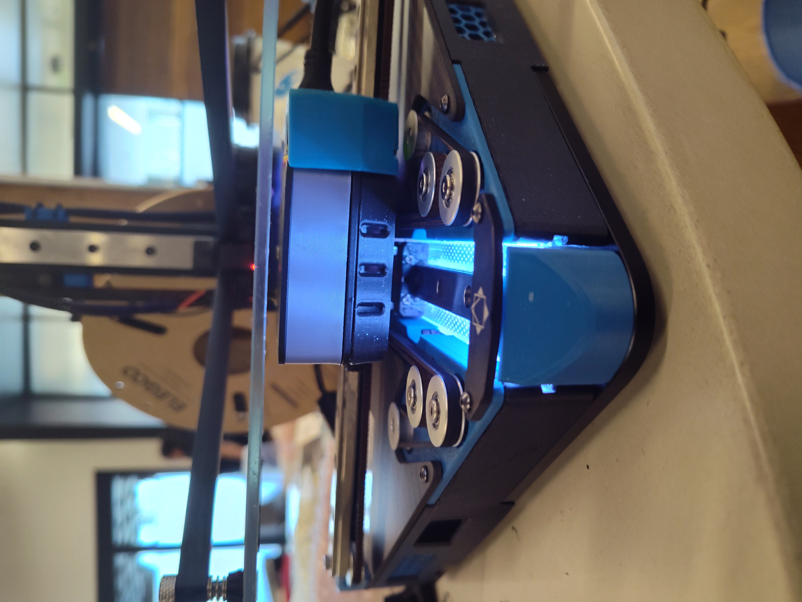
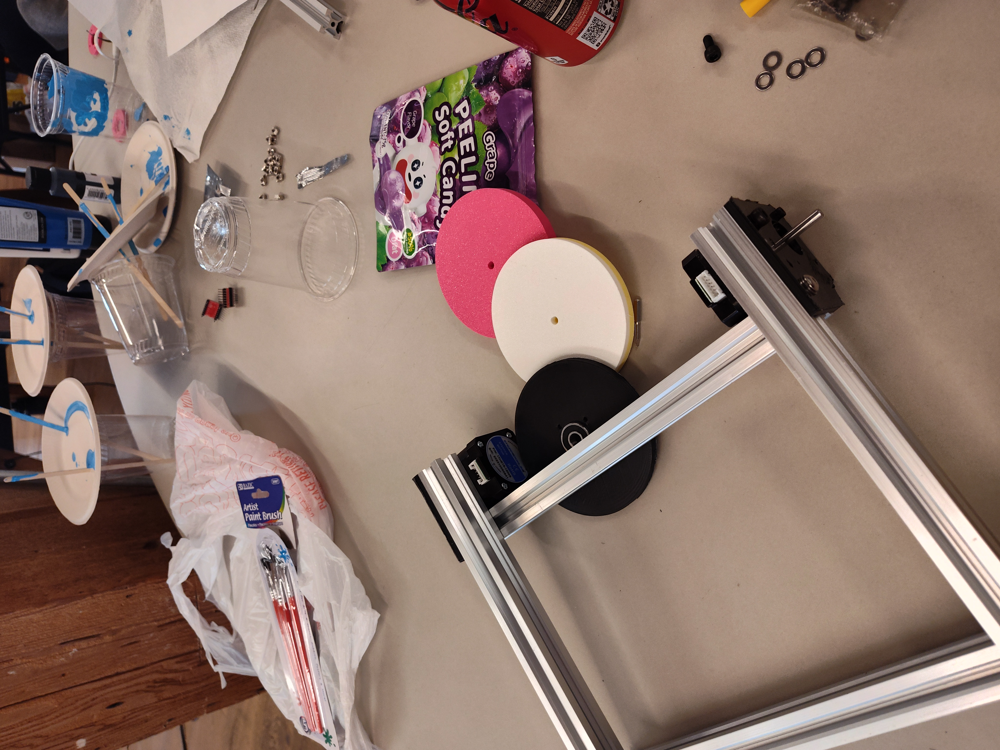

# Undercity RC car
The original goal of this project was a waymo + uber eats

A bit abitious and we did not even get close but we have learnt many things along the way.

## [BOM](https://docs.google.com/spreadsheets/d/1kpuyQziQVE7cKFnH4VXbR72QkuAozz1iUb7t4SHraTE/edit?gid=0#gid=0) | [CAD](https://cad.onshape.com/documents/02723c9a3e55e561db2bc831/w/5784b4d1d5954fd8c7eb26be/e/960f16c7a37f44b90e76f9a4) | [Video](https://youtube.com/shorts/TxwMNDkV9N8)

  
